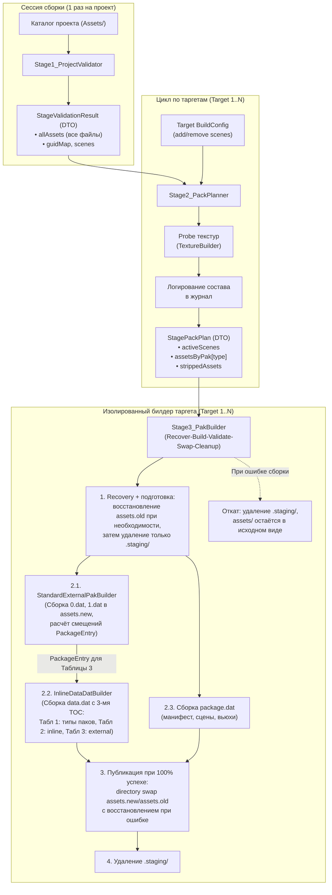

# Этап 26. Трёхсекционный TOC data.dat, внешние пакеты и модульный конвейер PackagePacker

**Статус:** ✅ Завершён

> [!IMPORTANT]
> Этот файл — источник истины для этапа 26. Этап целиком посвящён **структурам оглавления (TOC), форматам пакетов и модульному конвейеру сборщика `PackagePacker`**. Запекание текстур выполняется через библиотеку `texture_builder` (**Этап 25**). Runtime-монтирование нового `data.dat`, чтение внешних паков, zero-allocation парсинг данных, CPU-контур меша и последующий GPU upload вынесены в **Этап 27**. В Этапе 26 реализуется только builder-side parser/validator нового формата, необходимый для проверки результата перед публикацией и для тестов writer-а.

---

## 🎯 Цель этапа

1. Сформировать новую архитектуру бинарного архива `data.dat` с **трёхсекционным оглавлением (TOC)**:
   - **Таблица 1 (PackManifestTable):** компактный массив типов внешних паков `eDataDatType` (элементы `[0..N-1]`, имена файлов однозначно вычисляются через `GetPakFileName(type)`).
   - **Таблица 2 (InlinePackageEntryTable):** ресурсы, встроенные непосредственно в тело `data.dat` (`Mesh`, `Material`, `Shader`, `Animation`). Каждая запись содержит 32 байта `AssetMetadata`.
   - **Таблица 3 (ExternalPackageEntryTable):** ресурсы, вынесенные во внешние `N.dat` файлы (`Texture2D` $\to$ `0.dat`, `AudioClip` $\to$ `1.dat` и т. д.). Каждая запись содержит 32 байта `AssetMetadata` и смещение внутри соответствующего `N.dat` файла.
2. Реализовать строгое архитектурное разделение:
   - **`src/core/` (Ядро runtime):** только общие контракты, `constexpr` сопоставление паков, резолвер путей `ResolvePakPath(type)`, заголовки и структуры записей. Никакой логики сборки, стадий, запекания текстур или компиляции.
   - **`src/tools/assets_builder/assets_builder_dll/` (Сборщик):** модульный конвейер (Pipeline + DTO + Strategy) из независимых стадий с префиксом `Stage`.
3. Модернизировать `PackagePacker` в легковесный оркестратор:
   - Стадия 1 (`Stage1_ProjectValidator`) — общая на всю сессию сборки (выполняется 1 раз для проекта).
   - Стадия 2 (`Stage2_PackPlanner`) — индивидуальна для каждого таргета: раскручивает граф зависимостей от подключённых сцен (`add_scenes`/`remove_scenes`) и представлений (`startView`, `platform.child_views`, `platform.independent_views`), отсекает неиспользуемые ассеты (dead-code stripping), выполняет быстрый `Probe` текстур и выводит подробную сводную таблицу состава ресурсов в лог перед началом запекания.
   - Стадия 3 (`Stage3_PakBuilder` + паттерн Strategy `IPakBuilder`) — индивидуальна для каждого таргета: строгий изолированный цикл **Recover-Build-Validate-Swap-Cleanup** с рабочей папкой `.staging/`.
4. Подготовить тестовые ассеты (текстуры, звуки) в проекте `zzz_assets_test_000` и зарегистрировать `TextureImporter` (на базе `texture_builder`) и `AudioImporter` в `AssetImporterRegistry`.

---

## 📐 Архитектурные контракты сборщика и форматов

### 1. Трёхсекционный TOC `data.dat`
`data.dat` использует трёхсекционный layout оглавления. Заголовок `DataDatHeader` использует существующий `c_DataDatFormat = { "ZDD", Version(1, 0, 0) }`. Формат ещё находится в разработке и не считается опубликованным или замороженным: до завершения всего связанного конвейера его layout можно менять без повышения версии.
- Заголовок `DataDatHeader` для `c_DataDatFormat`:
  * Базовое поле `m_EntryCount` хранит **общее число ассетов** в архиве: `inlineCount + externalCount`. Это даёт быстрый общий счётчик без парсинга Extra.
  * Содержит блок дополнительных данных `DataDatHeaderExtra`:
    - `packCount` — количество записей в Манифесте паков (Таблица 1);
    - `inlineCount` — количество встроенных ресурсов (Таблица 2);
    - `externalCount` — количество внешних ресурсов (Таблица 3).
  * Единый `buildTime` (timestamp сборки в миллисекундах) для валидации согласованности `package.dat`, `data.dat` и всех внешних `.dat` пакетов.
  * Для `c_PackageDatFormat` заголовок и версия остаются без изменений (`entryCount`, 31 байт).
  * Для `PakFileHeader` поле `m_EntryCount` равно числу блобов этого типа во внешнем паке и обязано совпадать с числом соответствующих записей Таблицы 3.

---

### 2. Заголовок DatFileHeader, автовыравнивание и структуры записей

#### 2.1. Дисковые варианты `DatFileHeader` и автовыравнивание
Общий сериализатор заголовка получает явную policy/специализацию `Extra + Alignment`; выбор не должен зависеть от runtime-сравнения magic. Фиксируются три дисковых варианта:
- `PackageDatHeader`: без Extra, без дополнительного padding, **31 байт**;
- `DataDatHeader`: `DataDatHeaderExtra`, `Alignment = 64`, **64 байта**;
- `PakFileHeader`: без Extra, `Alignment = 4096`, **4096 байт**.

Размер padding рассчитывается по сериализованному размеру полей, а не через `sizeof` C++-класса/структуры:
$$\text{PaddingSize} = (\text{Alignment} - ((\text{BaseSize} + \text{ExtraSerializedSize}) \pmod{\text{Alignment}})) \pmod{\text{Alignment}}$$
- Для `data.dat` (`Alignment = 64`): $31 + 12 = 43 \to$ размер padding **21 байт**, итоговый размер заголовка ровно **64 байта**.
- Для `N.dat` (`Alignment = 4096`, без Extra): $31 + 0 = 31 \to$ размер padding **4065 байт**, итоговый размер заголовка ровно **4096 байт**.
- Extra записывается сразу после базового envelope, затем записывается нулевой padding. Дисковый порядок числовых полей — little-endian; GUID сохраняется в уже принятом проектом 16-байтовом бинарном представлении. Layout проверяется golden-byte тестом.

#### 2.2. Блок `DataDatHeaderExtra` (12 байт)
```cpp
struct DataDatHeaderExtra
{
	zU32 packCount = 0;     // Количество внешних паков в Таблице 1
	zU32 inlineCount = 0;   // Количество записей в Таблице 2 (data.dat)
	zU32 externalCount = 0; // Количество записей в Таблице 3 (внешние N.dat)
};
```

#### 2.3. Таблица 1 (Список типов внешних паков)
Хранить GUID для паков не требуется, так как имя файла однозначно вычисляется из стабильного значения `eDataDatType` (порядковый номер внешнего типа):
```cpp
// Таблица 1: массив типов внешних паков (packCount элементов по 4 байта)
eDataDatType externalPackTypes[packCount];
```

**Единая таблица размещения типов (без отдельной ручной нумерации паков):**

| `eDataDatType` | Значение | Размещение | Поддержка импортёра в Этапе 26 |
|---|---:|---|---|
| `Mesh` | 1 | inline в `data.dat` | да |
| `Material` | 2 | inline в `data.dat` | да |
| `Shader` | 3 | inline в `data.dat` | да |
| `Animation` | 4 | inline в `data.dat` | нет, зарезервировано |
| `Texture2D` | 5 | `0.dat` | да |
| `AudioClip` | 6 | `1.dat` | да |
| `Video` | 7 | `2.dat` | нет, зарезервировано |
| `Font` | 8 | `3.dat` | нет, зарезервировано |
| `BinaryData` | 9 | `4.dat` | нет, зарезервировано |

Таблица 1 содержит только реально созданные непустые внешние паки, строго по возрастанию значения типа, без дубликатов. Каждая запись Таблицы 3 обязана ссылаться на тип, присутствующий в Таблице 1; inline-типы в Таблице 1 и внешние типы в Таблице 2 запрещены. GUID уникален сразу по Таблицам 2 и 3.

Числовые значения `eDataDatType` пока остаются частью разрабатываемого контракта и при необходимости могут быть скорректированы без повышения версии. Стабильным дисковым ABI они становятся только после отдельного решения о заморозке и публикации формата.

Зарезервированные типы входят в контракт размещения, но файл для них не создаётся без активных ресурсов и зарегистрированного импортёра. Достижимый ресурс неподдерживаемого типа завершает `Stage2_PackPlanner` ошибкой до сборки.

#### 2.4. `PackageEntry` (Таблицы 2 и 3 — единая структура записей 68 байт)
```cpp
class PackageEntry final : public ISerializable
{
	Guid          guid;      // 16 байт: уникальный идентификатор ресурса
	zU32          assetType; // 4 байта: eDataDatType (Mesh, Texture2D, Material...)
	zU64          offset;    // 8 байт: смещение данных (в data.dat для Таблицы 2, в N.dat для Таблицы 3)
	zU64          size;      // 8 байт: размер полезной нагрузки в байтах
	AssetMetadata metadata;  // 32 байта: union POD-метаданных ресурса (TextureMetadata, MeshMetadata...)
}; // Итого ровно 68 байт
```
* **Прямой доступ к метаданным:** метаданные ресурса (размеры текстуры, формат, число mips, число вершин/индексов меша) читаются напрямую из TOC за 0 обращений к полезной нагрузке.
* **Привязка к внешнему файлу:** определяется без хранимого имени через `GetPakFileName(static_cast<eDataDatType>(entry.GetAssetType()))`.
#### 2.5. Контроль и валидация смещений (Offset Validation & Invariants)
Для исключения повреждения данных, битых ссылок и наложения ресурсов друг на друга сборщик и ядро соблюдают строгие инварианты смещений:
1. **Правила выравнивания смещений:**
   - **Внешние паки (`N.dat`):** заголовок занимает ровно 4096 байт ($4 \text{ КБ}$). Первое смещение данных всегда $\ge 4096$. Все последующие смещения блобов ресурсов строго выровнены по 16 байтам: $\text{offset} \pmod{16} == 0$.
   - **Архив `data.dat` (Inline):** сначала вычисляется конец TOC, затем начало payload с padding до 16 байт:
     $$\text{tocEnd} = \text{headerSize} + \text{table1Size} + \text{table2Size} + \text{table3Size}$$
     $$\text{payloadBegin} = \operatorname{AlignUp}(\text{tocEnd}, 16)$$
     Байты между `tocEnd` и `payloadBegin` нулевые; все смещения полезной нагрузки удовлетворяют $\text{offset} \pmod{16} == 0$.
2. **Проверка границ и целостности диапазонов (Range Bounds):**
   - Для Таблицы 2 (встроенные ресурсы):
     $$\text{offset} \ge \text{payloadBegin} \quad \text{и} \quad \text{offset} + \text{size} \le \text{fileSize}(\texttt{data.dat})$$
   - Для Таблицы 3 (внешние ресурсы):
     $$\text{offset} \ge 4096 \quad \text{и} \quad \text{offset} + \text{size} \le \text{fileSize}(N\texttt{.dat})$$
3. **Защита от пересечений (Non-overlapping Invariant):**
   Внутри одного физического файла диапазоны ресурсов не должны накладываться друг на друга:
   $$[\text{offset}_i, \text{offset}_i + \text{size}_i) \cap [\text{offset}_j, \text{offset}_j + \text{size}_j) = \emptyset \quad \forall i \ne j$$
4. **Автоматический пост-контроль смещений перед публикацией (Sanity Check):**
   - Перед directory swap класс `Stage3_PakBuilder` выполняет обязательный проход `BuiltPackageValidator::Validate()`:
     * Заново читает `PackageEntry` из сгенерированного оглавления и сверяет их с реальными физическими размерами файлов `.staging/output/assets.new/`;
     * Проверяет `m_EntryCount == inlineCount + externalCount`, counts и переполнения при расчёте размеров, допустимость и уникальность типов манифеста, соответствие типов секциям, уникальность GUID, ненулевой размер payload, entryCount/timestamp всех файлов, отсутствие выхода за границы, корректность выравнивания и отсутствие коллизий;
     * В случае малейшего несоответствия сборка мгновенно прерывается, вызывается Rollback (очистка `.staging/`), а в лог пишется детальная ошибка.

---

### 3. Разграничение Core и Builder (Границы модулей)

#### 3.1. Ядро (`src/core/`) — только runtime-контракты
В ядро помещаются исключительно структуры и функции, необходимые для чтения и резолвинга данных во время работы движка:
1. **`PackagesConstants.h`:**
   - `std::string GetPakFileName(eDataDatType type)` (имя = порядковый номер внешнего типа без ведущих нулей + `c_DatExtension`):
     * `Texture2D` $\to$ `"0.dat"`
     * `AudioClip` $\to$ `"1.dat"`
     * `Video` $\to$ `"2.dat"`
     * `Font` $\to$ `"3.dat"`
     * `BinaryData` $\to$ `"4.dat"`
     * Для встроенных ресурсов (`Mesh`, `Material`, `Shader`, `Animation`) и невалидных значений возвращает пустую строку `""`.
   - Замена устаревших определений:
     * Удаляется устаревший `c_AssetPackageFormat` (`"ZAP"`) и упоминания `assets/{guid}.dat`.
     * Вводится актуальный формат внешних паков: `c_PakFileFormat { "ZPK"_magic, Version(1, 0, 0) }`, расширение общее — `c_DatExtension`.
2. **`src/core/io/storage/Path.h` / `Path.cpp`:**
   - Метод `Path::ResolvePakPath(eDataDatType type)`: возвращает путь к внешнему паку (`c_AssetsDirectoryName / GetPakFileName(type)`), используемый в `DataAssetsManager` для передачи в конструктор `ReadOnlyFile`.
3. **`DatFileHeader.h` и `PackageEntry.h`:**
   - Дисковые варианты заголовка с явной policy выравнивания и поддержкой `DataDatHeaderExtra`.
   - Используется единый разрабатываемый `c_DataDatFormat` версии `1.0.0`; параллельные V1/V2-константы и миграция между черновыми layout не вводятся. `c_PackageDatFormat` и `c_PakFileFormat` также остаются `1.0.0`.

> [!WARNING]
> В `src/core/` строго запрещено помещать логику сборки, код компиляции скриптов, манипуляции с `.staging/`, вызовы `TextureBuilder` или классы стадий.

---

### 4. Модульная архитектура сборщика (Pipeline + DTO + Strategy)

Вместо монолитного процедурного файла `PackagePacker.cpp` сборщик разбивается на независимые стадии с префиксом `Stage` и строгими классами данных (DTO):

```
src/tools/assets_builder/assets_builder_dll/
├── stages/
│   ├── StageValidationResult.h             // DTO: результат валидации проекта (все обнаруженные ресурсы)
│   ├── Stage1_ProjectValidator.h / .cpp    // Стадия 1: обнаружение и валидация проекта (общая на сессию)
│   ├── StagePackPlan.h                     // DTO: план упаковки таргета (сцены, корзины, статистика)
│   ├── Stage2_PackPlanner.h / .cpp         // Стадия 2: граф зависимостей, фильтрация, probe, статистика
│   ├── Stage3_PakBuilder.h / .cpp          // Recover-Build-Validate-Swap-Cleanup оркестратор таргета
│   ├── pak_builders/                       // Паттерн Strategy для запекания и сборки файлов
│       ├── IPakBuilder.h                   // Интерфейс стратегии сборки пака
│       ├── InlineDataDatBuilder.h / .cpp   // Сборщик data.dat (3 секции TOC + inline blobs)
│       └── StandardExternalPakBuilder.h/.cpp // Сборщик внешних паков (0.dat, 1.dat в этом этапе)
│   └── validation/
│       └── BuiltPackageValidator.h / .cpp  // Builder-side parser и полная проверка готового набора файлов
├── PackagePacker.h / .cpp                  // Легковесный фасад-оркестратор (~50-80 строк)
└── importers/
    ├── TextureImporter.h / .cpp            // Импортер текстур на базе TextureBuilder (Этап 25)
    └── AudioImporter.h / .cpp              // Импортер аудиофайлов (WAV/OGG)
```

---

### 5. Детализация стадий сборщика



#### 5.1. `Stage1_ProjectValidator` (Общая стадия сессии)
- **Область действия:** выполняется **ровно 1 раз** на сессию сборки для всего проекта, независимо от количества таргетов.
- **Обязанности:**
  * Сканирует директорию `Assets/` проекта через `AssetScanner`.
  * Валидирует целостность каждого `.meta` файла (корректность JSON, схемы, валидность GUID).
  * Проверяет отсутствие дубликатов GUID среди всех ресурсов проекта.
  * Классифицирует ресурсы через `AssetImporterRegistry`.
- **Выходные данные (`StageValidationResult`):**
  * `bool isValid`: флаг успешности валидации;
  * `std::string errorMessage`: описание первой критической ошибки при сбое;
  * `std::vector<ProjectAssetInfo> allAssets`: полный плоский список обнаруженных ассетов;
  * `std::unordered_map<Guid, std::size_t> guidToIndex`: быстрый индекс поиска по GUID;
  * `std::vector<std::string> discoveredScenes`: список всех найденных сцен.

#### 5.2. `Stage2_PackPlanner` (Индивидуальная стадия таргета)
- **Область действия:** выполняется **индивидуально для каждого таргета**.
- **Входные данные:** `const StageValidationResult&` + конфигурация таргета (`platformConfigFile`, правила `add_scenes`/`remove_scenes`, `startView`, `platform.child_views`, `platform.independent_views`).
- **Обязанности:**
  1. **Фильтрация сцен:** формирует финальный список активных сцен таргета на основе базового списка и переопределений таргета.
  2. **Раскрутка графа зависимостей:**
     - Обходит активные сцены (`.zscene`) $\to$ парсит сущности и компоненты $\to$ извлекает GUID сеток (`Mesh`) и материалов (`Material`).
     - Корнями представлений являются итоговые `startView`, `platform.child_views` и `platform.independent_views` после слияния project/platform-конфигов. Из активных `.zview` извлекаются GUID сцен, скриптов и data-ресурсов, описанных схемой представления.
     - Обходит материалы (`.zmaterial`) $\to$ извлекает GUID шейдеров (`Shader`) и текстур (`Texture2D`).
     - Рекурсивно собирает все достижимые ресурсы. Обход использует состояния `unvisited/visiting/visited`: повторные ссылки безопасны, цикл диагностируется без бесконечной рекурсии.
     - Отсутствующая ссылка, ссылка на GUID неправильного типа или неподдерживаемый тип активного ресурса являются критической ошибкой планирования до начала запекания.
  3. **Dead-Code Stripping (Отсечение мусора):**
     - Data-ресурсы из `allAssets`, не вошедшие в граф зависимостей активных сцен и представлений, помечаются как `stripped` и исключаются из сборки. Структурные ресурсы `package.dat`, скрипты и служебные файлы обрабатываются своими явными правилами и не удаляются лишь из-за отсутствия в data-графе.
  4. **Probe ресурсов:**
     - Для активных текстур вызывает легковесный `TextureBuilder::Probe` (быстрое чтение заголовка без полного декодирования) для извлечения исходных параметров (размеры, каналы, предварительный формат).
  5. **Вывод сводной таблицы в лог:**
     - Перед запуском тяжёлой сборки и запекания выводит в лог структурированную таблицу:
       * Список включённых сцен;
       * Состав встроенных ресурсов `data.dat` (количество мешей, материалов, шейдеров, анимаций);
       * Состав внешних паков (`0.dat`: список текстур, форматы, размеры; `1.dat`: список звуков);
       * Список отсеянных ресурсов (неиспользуемый контент).
  6. **Группировка по корзинам:**
     - Раскладывает активные ресурсы по корзинам типов: `assetsByPak[type]`.
- **Выходные данные (`StagePackPlan`):**
  * Список активных сцен;
  * Корзины ресурсов по типам (`eDataDatType`);
  * Список исключённых ресурсов;
  * Статистика объёмов и форматов.

#### 5.3. `Stage3_PakBuilder` и паттерн Strategy `IPakBuilder` (Индивидуальная стадия таргета)
- **Область действия:** выполняется **индивидуально для каждого таргета**.
- **Входные данные:** `const StagePackPlan&` + путь целевого каталога таргета (`destinationDir`).
- **Строгий транзакционный цикл сборки и отката:**
  1. **Recovery и подготовка (Recover + Clean Staging Only):**
     - Сначала завершает/откатывает незавершённый прошлый swap: `assets.old/` восстанавливается, если `assets/` отсутствует; если существуют оба каталога, опубликованный `assets/` сохраняется, а старый backup удаляется после проверки его состояния.
     - Затем удаляет исключительно каталог `.staging/` таргета (на случай аварийно прерванной прошлой сборки).
     - **Важно:** рабочий каталог `destinationDir/assets/` **НЕ очищается** на этом шаге, чтобы при ошибке сборки старая версия осталась в целостности.
  2. **Сборка в `.staging/` (Строгий порядок зависимостей):**
     - Создаёт изолированное дерево:
       ```
       destinationDir/.staging/
       ├── cache/
       │   ├── 0001_mesh/     -> {guid}.bin + {guid}.entry (32 байта MeshMetadata)
       │   ├── 0002_material/ -> {guid}.bin + {guid}.entry (32 байта MaterialMetadata)
       │   ├── 0003_shader/   -> {guid}.bin + {guid}.entry (32 байта ShaderMetadata)
       │   ├── 0005_texture/  -> {guid}.bin + {guid}.entry (32 байта TextureMetadata)
       │   └── 0006_audio/    -> {guid}.bin + {guid}.entry (32 байта AudioClipMetadata)
       ├── system/
       │   ├── project_manifest.bin
       │   ├── scenes/{guid}.bin
       │   └── views/{guid}.bin
       └── output/assets.new/
           ├── package.dat
           ├── data.dat
           ├── 0.dat
           └── 1.dat
       ```
     - **Порядок сборки паков (разрешение смещений Таблицы 3):**
       * **Шаг 2.1 (Сборка внешних паков `StandardExternalPakBuilder`):**
          Внешние паки (`0.dat`, `1.dat` для реализуемых в этом этапе типов) собираются **первыми**. Сборщик внешнего пака записывает 4 КБ заголовок `PakFileHeader` (`"ZPK"`, версия 1.0.0, единый timestamp сборки) и выровненные по 16 байт блобы ресурсов.
         На выходе `StandardExternalPakBuilder` возвращает список готовых `PackageEntry` с вычисленными смещениями `offset` (от начала соответствующего `N.dat` файла) и `size`.
       * **Шаг 2.2 (Сборка `InlineDataDatBuilder`):**
          Получает записи Таблицы 3 от внешних сборщиков и собирает `output/assets.new/data.dat`:
         1. Заголовок `DataDatHeader` (сигнатура `"ZDD"`, разрабатываемая версия 1.0.0, размер 64 байта, блок `DataDatHeaderExtra`).
         2. Таблица 1: компактный массив типов внешних паков (`packCount` элементов `eDataDatType`).
         3. Таблица 2: массив встроенных записей `PackageEntry` (`inlineCount` элементов).
         4. Таблица 3: массив внешних записей `PackageEntry` (`externalCount` элементов с точными смещениями).
         5. Полезная нагрузка: склеенные блобы встроенных ресурсов с выравниванием по 16 байт.
       * **Шаг 2.3 (Сборка системного пакета `package.dat`):**
          Сериализует манифест проекта, декларации представлений (Views) и активные сцены.
       * **Шаг 2.4 (Проверка готового набора):**
         `BuiltPackageValidator` заново читает файлы из `assets.new`, не доверяя объектам writer-а, и проверяет весь контракт TOC, диапазонов, manifest и timestamp.
   3. **Публикация (Recoverable Directory Swap):**
      - Выполняется **только после 100% успешной сборки и повторной проверки всех архивов** на том же томе файловой системы:
        1. При старте восстанавливается незавершённая прошлая публикация: если `assets/` отсутствует, а `assets.old/` существует, `assets.old/` возвращается на место.
        2. Существующий `destinationDir/assets/`, если он есть, переименовывается в `destinationDir/assets.old/`.
        3. Готовый `.staging/output/assets.new/` одним rename переносится в `destinationDir/assets/`.
        4. Если шаг 3 завершился ошибкой, старый каталог немедленно восстанавливается из `assets.old/`; ошибка сборки возвращается вызывающему коду.
        5. Только после успешного swap удаляется `assets.old/`.
      - GUI/CLI не имеют права заранее удалять или создавать заново `destinationDir/assets/`; соответствующая текущая логика удаляется.
      - Транзакционная граница Этапа 26 — только каталог `assets/`. Генерация headers, скриптов и `Scripts.cmake` остаётся отдельной стадией внешнего build-конвейера и не объявляется частью атомарной публикации паков.
  4. **Очистка (Cleanup):**
     - Полное удаление папки `.staging/`.
  5. **Откат при ошибке (Rollback):**
      - Если сборка упала на шагах 1–2, удаляется только `.staging/`, а `destinationDir/assets/` остаётся неизменным. Если сбой произошёл во время swap, выполняется восстановление `assets.old/`; следующее начало сборки также выполняет recovery незавершённого swap.

#### 5.4. `PackagePacker` и управление сессией сборки в API
- **Проблема одиночных вызовов из C#:** C# GUI (`MainWindowViewModel.cs`) и CLI вызывают сборку каждого таргета отдельно через `NativeMethods.PackProjectNative`.
- **Решение: Сессионное кэширование валидации:**
  * В `BuilderApi` добавляются методы управления сессией сборки проекта:
    ```cpp
    BUILDER_API bool BeginBuildSessionNative(const char* projectDir, char* errorBuffer, uint32_t errorBufferSize);
    BUILDER_API void EndBuildSessionNative();
    ```
  * `BeginBuildSessionNative` запускает `Stage1_ProjectValidator::Validate` один раз, кэширует `StageValidationResult` внутри `PackagePacker` и возвращает результат.
  * Последующие вызовы `PackProjectNative` в рамках сессии используют закэшированный `StageValidationResult`, пропуская повторное сканирование и сразу переходя к `Stage2_PackPlanner` и `Stage3_PakBuilder`.
  * `EndBuildSessionNative` очищает кэш сессии.
  * **Контроль проекта сессии:** если `sourceDir` в `PackProjectNative` не совпадает с `projectDir` активной сессии (сравнение канонических путей), вызов завершается ошибкой без сборки.
  * **Fallback обратной совместимости:** если `PackProjectNative` вызывается без предварительного `BeginBuildSession` (например, в юнит-тестах), он автоматически выполняет `Stage1_ProjectValidator` локально для этого вызова.
  * Сессия process-wide, защищена mutex и не допускает вложенный/параллельный `BeginBuildSessionNative`; повторный `Begin` возвращает явную ошибку. `EndBuildSessionNative` идемпотентен. Закэшированный `StageValidationResult` после успешного `Begin` неизменяем.
  * Контракт snapshot: проект не должен изменяться между `BeginBuildSessionNative` и `EndBuildSessionNative`. GUI блокирует редактирование на время build; изменение файлов внешним процессом диагностируется по сохранённым для активных ассетов `last_write_time + file_size` перед каждым таргетом и завершает сборку с просьбой начать новую сессию.
  * В `NativeMethods.cs` и managed `PackagePacker` добавляются обёртки Begin/End. Оба GUI/headless build-цикла вызывают `Begin` один раз перед циклом таргетов и гарантированно вызывают `End` в `finally`, включая отмену и исключения.
  * Native ABI использует `[return: MarshalAs(UnmanagedType.I1)]` для всех экспортов C++ `bool`; строки путей передаются единообразно как UTF-8. Ошибка `Begin` и ошибка упаковки доступны вызывающему коду через единый error buffer/метод получения последней ошибки, а не только через лог.

---

### 6. Импортёры ресурсов

#### 6.0. Входной контракт с Этапом 25
- До начала реализации `TextureImporter` должны быть собраны и зафиксированы публичные DTO/API `texture_builder`: `Probe`, `Import`, описание бинарного texture blob, набор реально поддерживаемых форматов и правила передачи ошибок без исключений через ABI.
- Этап 26 не считается заблокированным для TOC/pipeline-части, но интеграция и приёмка текстур не завершаются, пока этот контракт Этапа 25 не стабилен.
- Если ASTC/ETC2 encoder к моменту интеграции отсутствует, действует явно описанный ниже fallback в RGBA8; план и тесты не должны одновременно заявлять нативный ASTC и проверять fallback.

#### 6.1. `TextureImporter` и спецификация `.meta` файлов текстур
- **Структура `.meta` файлов текстур (по аналогии с Unity TextureImporter):**
  Файлы метаданных текстур содержат дефолтные параметры импорта и секцию платформных переопределений:
  ```json
  {
    "guid": "00000000-0000-0000-0000-000000000041",
    "textureSettings": {
      "textureType": "Color",        // "Color", "NormalMap", "Grayscale", "SingleChannel"
      "generateMipMaps": true,       // генерация полной цепочки мип-уровней
      "maxTextureSize": 2048         // максимальный размер (512, 1024, 2048, 4096)
    },
    "platformSettings": {
      "Desktop": {
        "format": "BC7"              // BC7, BC5, BC4, BC1, RGBA8
      },
      "Mobile": {
        "format": "ASTC_4x4"         // ASTC_4x4, ASTC_6x6, ETC2_RGBA8
      }
    }
  }
  ```
- **Правило вывода гаммы (sRGB) из `textureType`:**
  * `Color` $\to$ `sRGB = true` (цвета/альбедо).
  * `NormalMap` $\to$ `sRGB = false` (математические нормали).
  * `Grayscale` / `SingleChannel` $\to$ `sRGB = false` (PBR маски).
- **Иерархия разрешения настроек (Hierarchy Fallback) в `TextureImporter`:**
  1. Поиск переопределения под конкретную целевую платформу (`"Windows"`, `"Android"`, `"iOS"`...).
  2. Если не найдено $\to$ поиск по семейству платформ (`"Desktop"` для Windows/Linux/MacOS, `"Mobile"` для Android/iOS).
  3. Если не найдено $\to$ используются базовые параметры из `"textureSettings"`.
  4. Авто-дефолты формата: если формат не указан явно, сборщик выбирает оптимальный:
     - Desktop: `Color` $\to$ `BC7_SRGB`, `NormalMap` $\to$ `BC5_UNORM`, `Grayscale` $\to$ `BC4_UNORM`.
     - Mobile: `Color` $\to$ `ASTC_4x4_SRGB`, `NormalMap` $\to$ `ASTC_4x4_UNORM`.
- **Реализация `TextureImporter` и поддерживаемые форматы:**
  * Размещается в `src/tools/assets_builder/assets_builder_dll/importers/TextureImporter.h / .cpp`.
  * Использует библиотеку `texture_builder.lib` (Этап 25).
  * **Поддерживаемые расширения файлов (загрузка через stb_image):** `.png`, `.jpg`, `.jpeg`, `.tga`, `.bmp`. (Формат `.dds` исключён из Этапа 26, так как требует отдельного пайплайна прямого парсинга).
  * **Поддерживаемые форматы сжатия:** Desktop-контур через `DirectXTex` (BC1, BC3, BC4, BC5, BC7 и несжатый RGBA8).
  * **Статус мобильных форматов (ASTC / ETC2):** в Этапе 26 они зафиксированы в `.meta` как задел на будущее, энкодера в `texture_builder` нет.
    - Desktop-таргет: запекаются BCn/RGBA8; формат ASTC/ETC2, указанный в `.meta` для Desktop, заменяется на авто-дефолт BCn с предупреждением в лог.
    - Mobile-таргет (Android/iOS): текстуры запекаются в несжатый `RGBA8` (sRGB по правилу `textureType`) с предупреждением в лог. Сборка не падает.
  * `Probe`: быстрое извлечение метаданных текстуры без полного сжатия.
  * `Import`: конвертация текстуры с генерацией mip-уровней, сжатием в BCn/RGBA8 и заполнением 32-байтовой структуры `TextureMetadata`.
  * Регистрация расширений `.png`, `.jpg`, `.jpeg`, `.tga`, `.bmp` в `AssetImporterRegistry`.

#### 6.2. `AudioImporter`
- Размещается в `src/tools/assets_builder/assets_builder_dll/importers/AudioImporter.h / .cpp`.
- Базовый импорт аудиофайлов `.wav`, `.ogg` в бинарный блоб с заполнением `AudioClipMetadata` (32 байта).
- Регистрация расширений `.wav`, `.ogg` в `AssetImporterRegistry`.

---

## 🛠️ План реализации этапа 26

### Шаг 1. Ядро (Core) — минимальный разделяемый контракт
- [x] В `src/core/constants/PackagesConstants.h`:
  * Добавить `std::string GetPakFileName(eDataDatType type)`.
  * Использовать единый `c_DataDatFormat { "ZDD"_magic, Version(1, 0, 0) }` и `c_PackageDatFormat { "ZPD"_magic, Version(1, 0, 0) }`.
  * Добавить формат `c_PakFileFormat { "ZPK"_magic, Version(1, 0, 0) }`, использовать `c_DatExtension` для всех пакетов.
  * Удалить устаревший `c_AssetPackageFormat` (`"ZAP"`, вне файла не используется) и обновить шапку-комментарий (`assets/{guid}.dat` $\to$ `assets/N.dat`).
- [x] В `src/core/io/storage/Path.h` / `Path.cpp`:
  * Добавить метод `ResolvePakPath(eDataDatType type)`.
- [x] В `src/core/io/DatFileHeader.h`:
  * Реализовать структуру `DataDatHeaderExtra` (`packCount`, `inlineCount`, `externalCount`).
  * Реализовать явные дисковые варианты заголовка: 31 байт для `package.dat`, 64 байта для `data.dat`, 4096 байт для `N.dat`; не выбирать layout через runtime magic.
- [x] Проверить структуру `PackageEntry.h` (68 байт, интеграция с 32-байтным `AssetMetadata`).
- [x] Зафиксировать таблицу размещения всех `eDataDatType` в `GetPakFileName`: inline для 1–4, внешние `0.dat`–`4.dat` для 5–9 (тесты пропущены по указанию пользователя).

### Шаг 2. DTO и интерфейсы стадий сборщика
- [x] Создать `StageValidationResult.h` (DTO первой стадии).
- [x] Создать `StagePackPlan.h` (DTO второй стадии: сцены, корзины паков, статистика).
- [x] Создать интерфейс стратегии `IPakBuilder.h` в `stages/pak_builders/`.

### Шаг 3. Реализация стадий конвейера
- [x] Реализовать `Stage1_ProjectValidator` (на базе рефакторинга `ProjectIdentityValidator`):
  * Двухпроходное сканирование, проверка GUID и JSON, сбор плоского списка `allAssets`.
- [x] Реализовать `Stage2_PackPlanner`:
  * Раскрутка графа зависимостей от сцен (`add_scenes`/`remove_scenes`) и представлений (`startView`, `platform.child_views`, `platform.independent_views`) с visited-state и типизированной проверкой каждой ссылки.
  * Отсечение неиспользуемых ассетов (dead-code elimination).
  * Вызов `TextureBuilder::Probe` для активных текстур.
  * Форматированный вывод состава сборки в журнал (таблица включённых и исключённых ресурсов).
  * Распределение по корзинам `assetsByPak`.
- [x] Реализовать стратегии сборки паков:
  * `StandardExternalPakBuilder`: запекание текстур/звуков, сборка `0.dat`, `1.dat` в `assets.new/` с 4 КБ заголовком и возвратом `PackageEntry` со смещениями.
  * `InlineDataDatBuilder`: получение внешних записей Таблицы 3, запекание поддержанных inline-типов (в Этапе 26: меши/материалы/шейдеры), сборка трёхсекционного `data.dat`.
- [x] Реализовать `Stage3_PakBuilder`:
  * Строгий цикл: recovery прошлой публикации, очистка только `.staging/`, сборка полного `assets.new/`, независимая проверка через `BuiltPackageValidator`, recoverable swap через `assets.old/`, очистка временных каталогов.
  * Удалить из GUI/headless предварительное удаление `destinationDir/assets/`.
- [x] Рефакторинг `PackagePacker` и методы сессии в `BuilderApi`:
  * Добавить `BeginBuildSessionNative` / `EndBuildSessionNative` с сессионным кэшем валидации.
  * Добавить C# P/Invoke и managed-обёртки; вызывать Begin один раз на build и End в `finally` во всех GUI/headless путях.
  * Зафиксировать process-wide синхронизацию, snapshot-проверку проекта, UTF-8 ABI, маршалинг `bool` и получение текста ошибки.
  * Сократить `PackagePacker` до легковесного оркестратора (~50-80 строк).

### Шаг 4. Импортёры и тестовые ассеты
- [x] Реализовать `TextureImporter` с подключением `texture_builder.lib` (поддержка `.png`, `.jpg`, `.jpeg`, `.tga`, `.bmp` и форматов BCn/RGBA8).
- [x] Реализовать базовый `AudioImporter`.
- [x] Зарегистрировать импортёры в `AssetImporterRegistry`.
- [x] Проверить/дополнить тестовые ассеты в `src/projects/assets_projects/zzz_assets_test_000/Assets/`:
  * `Assets/Textures/`: `tt_1.png` .. `tt_6.png` + `.meta` файлы.
  * `Assets/Audio/`: создать `click.wav` + `.meta`.

### Шаг 5. Верификация и компиляция
- [x] Собрать `texture_builder`, `assets_builder_dll`, C# приложения `assets_builder_lib` и `assets_builder_gui`.
- [-] Unit-тесты пропущены по указанию пользователя ("тесты не надо").
- [x] Целостность ядра, сборщика и управляемых слоёв подтверждена чистой компиляцией всех таргетов.


---

## 🏆 Критерии приёмки этапа 26

1. **Строгая граница Core / Builder:** ядро `src/core/` не содержит ни единой строчки кода сборщика, `texture_builder` или стадий.
2. **Модульность конвейера:** сборщик разделен на `Stage1_ProjectValidator`, `Stage2_PackPlanner`, `Stage3_PakBuilder` и стратегии `IPakBuilder` с передачей через DTO.
3. **Оптимизация сессии сборки:** сессионный кэш валидации (`BeginBuildSessionNative`) обеспечивает запуск `Stage1` строго 1 раз на всю сессию сборки нескольких таргетов.
4. **Информативность логов:** перед началом тяжёлой сборки таргета в лог выводится сводная таблица состава ресурсов (включённые сцены, паки, форматы, отсеянный контент).
5. **Трёхсекционный TOC `data.dat`:** создаётся корректный заголовок (64 байта) и три секции: Таблица 1 (уникальные отсортированные типы реально существующих внешних паков), Таблица 2 (встроенные `PackageEntry`), Таблица 3 (внешние `PackageEntry` с точными смещениями внутри `N.dat`). Версия формата остаётся 1.0.0; runtime reader обновляется в Этапе 27.
6. **Внешние `N.dat` файлы:** внешние файлы собираются до `data.dat`, имеют 4 КБ заголовок `PakFileHeader`, корректный `entryCount` и выровненные по 16 байтам блобы данных.
7. **Независимая проверка результата:** перед публикацией `BuiltPackageValidator` повторно читает файлы с диска и проверяет counts/overflow, manifest, GUID, timestamps, кратность 16, границы файлов и отсутствие пересечения интервалов.
8. **Изоляция и восстанавливаемая публикация:** GUI/CLI заранее не удаляют `assets/`; до успешной проверки рабочий каталог не меняется, swap использует `assets.old/`, а ошибка или прерывание восстанавливаются немедленно либо recovery следующего запуска.
9. **Граница с Этапом 27:** Этап 26 проверяет writer builder-side parser-ом; runtime-монтирование `data.dat` и чтение внешних `N.dat` реализуются и принимаются в Этапе 27.
