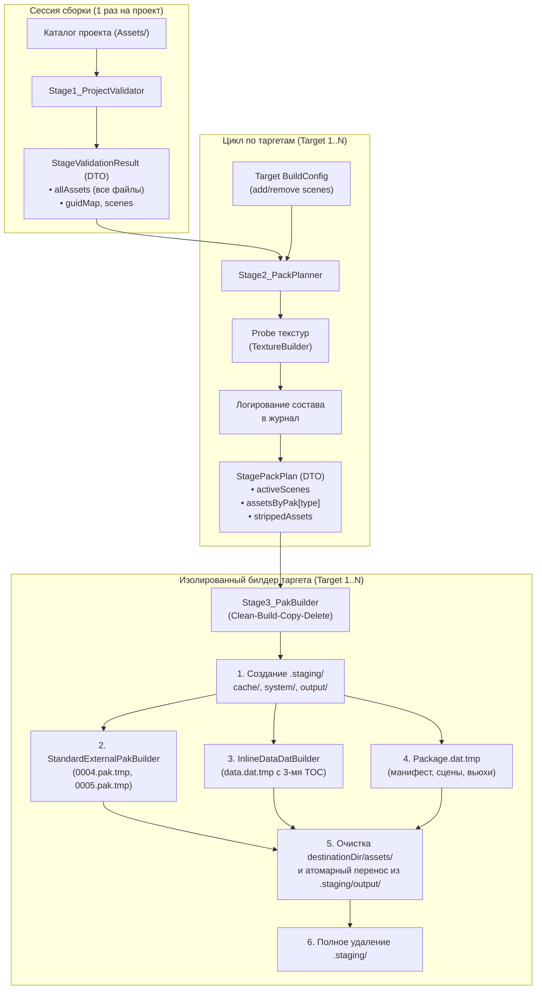

# Этап 26. Трёхсекционный TOC data.dat, внешние пакеты и модульный конвейер PackagePacker

**Статус:** 🚀 В работе

> [!IMPORTANT]
> Этот файл — источник истины для этапа 26. Этап целиком посвящён **структурам оглавления (TOC), форматам пакетов и модульному конвейеру сборщика `PackagePacker`**. Запекание текстур выполняется через библиотеку `texture_processor_lib` (**Этап 25**). Чтение архивов, zero-allocation парсинг данных, CPU-контур меша и последующий GPU upload вынесены в **Этап 27**.

---

## 🎯 Цель этапа

1. Сформировать новую архитектуру бинарного архива `data.dat` с **трёхсекционным оглавлением (TOC)**:
   - **Таблица 1 (PackManifestTable):** компактный массив типов внешних паков `eDataDatType` (элементы `[0..N-1]`, имена файлов однозначно вычисляются через `GetPakFileName(type)` в `constexpr`).
   - **Таблица 2 (InlinePackageEntryTable):** ресурсы, встроенные непосредственно в тело `data.dat` (`Mesh`, `Material`, `Shader`). Каждая запись содержит 32 байта `AssetMetadata`.
   - **Таблица 3 (ExternalPackageEntryTable):** ресурсы, вынесенные во внешние `.pak` файлы (`Texture2D` $\to$ `0004.pak`, `AudioClip` $\to$ `0005.pak`). Каждая запись содержит 32 байта `AssetMetadata` и смещение внутри соответствующего `.pak` файла.
2. Реализовать строгое архитектурное разделение:
   - **`src/core/` (Ядро runtime):** только общие контракты, `constexpr` сопоставление паков, резолвер путей `ResolvePakPath(type)`, заголовки и структуры записей. Никакой логики сборки, стадий, запекания текстур или компиляции.
   - **`src/tools/assets_builder/assets_builder_dll/` (Сборщик):** модульный конвейер (Pipeline + DTO + Strategy) из независимых стадий с префиксом `Stage`.
3. Модернизировать `PackagePacker` в легковесный оркестратор:
   - Стадия 1 (`Stage1_ProjectValidator`) — общая на всю сессию сборки (выполняется 1 раз для проекта).
   - Стадия 2 (`Stage2_PackPlanner`) — индивидуальна для каждого таргета: раскручивает граф зависимостей от подключённых сцен (`add_scenes`/`remove_scenes`), отсекает неиспользуемые ассеты (dead-code stripping), выполняет быстрый `Probe` текстур и выводит подробную сводную таблицу состава ресурсов в лог перед началом запекания.
   - Стадия 3 (`Stage3_PakBuilder` + паттерн Strategy `IPakBuilder`) — индивидуальна для каждого таргета: строгий изолированный цикл **Clean-Build-Copy-Delete** в папке `.staging/`.
4. Подготовить тестовые ассеты (текстуры, звуки) в проекте `zzz_assets_test_000` и зарегистрировать `TextureImporter` (на базе `TextureBuilder`) и `AudioImporter` в `AssetImporterRegistry`.

---

## 📐 Архитектурные контракты сборщика и форматов

### 1. Трёхсекционный TOC `data.dat`
`data.dat` обновляется на трёхсекционный TOC без изменения версии формата (in-place обновление черновика):
- Заголовок `DatFileHeader` для `c_DataDatFormat`:
  * Содержит блок дополнительных данных `DataDatHeaderExtra`:
    - `packCount` — количество записей в Манифесте паков (Таблица 1);
    - `inlineCount` — количество встроенных ресурсов (Таблица 2);
    - `externalCount` — количество внешних ресурсов (Таблица 3).
  * Единый `buildTime` (timestamp сборки в миллисекундах) для валидации согласованности всех архивов пакета.
  * Для `c_PackageDatFormat` заголовок остаётся без изменений (`entryCount`).

---

### 2. Заголовок DatFileHeader, автовыравнивание и структуры записей

#### 2.1. Автовыравнивание в `DatFileHeader`
В класс `DatFileHeader` добавляется расчёт размера падинга с автовыводом на основе шага выравнивания `Alignment`:
$$\text{PaddingSize} = (\text{Alignment} - ((\text{BaseSize} + \text{sizeof(Extra)}) \pmod{\text{Alignment}})) \pmod{\text{Alignment}}$$
- Для `data.dat` (`Alignment = 64`): $31 + 12 = 43 \to$ размер падинга **21 байт**, итоговый размер заголовка ровно **64 байта**.
- Для `.pak` (`Alignment = 4096`, без Extra): $31 + 0 = 31 \to$ размер падинга **4065 байт**, итоговый размер заголовка ровно **4096 байт**.

#### 2.2. Блок `DataDatHeaderExtra` (12 байт)
```cpp
struct DataDatHeaderExtra
{
	zU32 packCount = 0;     // Количество внешних паков в Таблице 1
	zU32 inlineCount = 0;   // Количество записей в Таблице 2 (data.dat)
	zU32 externalCount = 0; // Количество записей в Таблице 3 (внешние .pak)
};
```

#### 2.3. Таблица 1 (Список типов внешних паков)
Хранить GUID для паков не требуется, так как имя файла (`0004.pak`, `0005.pak`) однозначно вычисляется из типа ресурса в `constexpr`:
```cpp
// Таблица 1: массив типов внешних паков (packCount элементов по 4 байта)
eDataDatType externalPackTypes[packCount];
```

#### 2.4. `PackageEntry` (Таблицы 2 и 3 — единая структура записей 68 байт)
```cpp
class PackageEntry final : public ISerializable
{
	Guid          guid;      // 16 байт: уникальный идентификатор ресурса
	zU32          assetType; // 4 байта: eDataDatType (Mesh, Texture2D, Material...)
	zU64          offset;    // 8 байт: смещение данных (в data.dat для Таблицы 2, в 000X.pak для Таблицы 3)
	zU64          size;      // 8 байт: размер полезной нагрузки в байтах
	AssetMetadata metadata;  // 32 байта: union POD-метаданных ресурса (TextureMetadata, MeshMetadata...)
}; // Итого ровно 68 байт
```
* **Прямой доступ к метаданным:** метаданные ресурса (размеры текстуры, формат, число mips, число вершин/индексов меша) читаются напрямую из TOC за 0 обращений к полезной нагрузке.
* **Привязка к внешнему файлу:** вычисляется в `constexpr` за 0 тактов CPU через `GetPakFileName(static_cast<eDataDatType>(entry.GetAssetType()))`.

---

### 3. Разграничение Core и Builder (Границы модулей)

#### 3.1. Ядро (`src/core/`) — только runtime-контракты
В ядро помещаются исключительно структуры и функции, необходимые для чтения и резолвинга данных во время работы движка:
1. **`PackagesConstants.h`:**
   - `constexpr std::string_view GetPakFileName(eDataDatType type)`:
     * `Texture2D` $\to$ `"0004.pak"`
     * `AudioClip` $\to$ `"0005.pak"`
     * `Video` $\to$ `"0006.pak"`
     * `Font` $\to$ `"0007.pak"`
     * `BinaryData` $\to$ `"0008.pak"`
     * Для встроенных ресурсов (`Mesh`, `Material`, `Shader`) возвращает пустую строку `""`.
   - Сигнатура формата паков: `c_PakFileFormat { "ZPK"_magic, Version(1, 0, 0) }`.
2. **`src/core/io/storage/Path.h` / `Path.cpp`:**
   - Метод `Path::ResolvePakPath(eDataDatType type)`: возвращает путь к внешнему паку (`c_AssetsDirectoryName / GetPakFileName(type)`), используемый в `DataAssetsManager` для передачи в конструктор `ReadOnlyFile`.
3. **`DatFileHeader.h` и `PackageEntry.h`:**
   - Структура заголовка с автовыравниванием и поддержкой `DataDatHeaderExtra`.

> [!WARNING]
> В `src/core/` строго запрещено помещать логику сборки, код компиляции скриптов, манипуляции с `.staging/`, вызовы `TextureBuilder` или классы стадий.

---

### 4. Модульная архитектура сборщика (Pipeline + DTO + Strategy)

Вместо монолитного процедурного файла `PackagePacker.cpp` сборщик разбивается на независимые стадии с префиксом `Stage` и строгими классами данных (DTO):

```
src/tools/assets_builder/assets_builder_dll/
├── stages/
│   ├── StageValidationResult.h             // DTO: результат валидации проекта (все обнаруженные ресурсы)
│   ├── Stage1_ProjectValidator.h / .cpp    // Стадия 1: обнаружение и валидация проекта (общая на сессию)
│   ├── StagePackPlan.h                     // DTO: план упаковки таргета (сцены, корзины, статистика)
│   ├── Stage2_PackPlanner.h / .cpp         // Стадия 2: граф зависимостей, фильтрация, probe, статистика
│   ├── Stage3_PakBuilder.h / .cpp          // Стадия 3: Clean-Build-Copy-Delete оркестратор таргета
│   └── pak_builders/                       // Паттерн Strategy для запекания и сборки файлов
│       ├── IPakBuilder.h                   // Интерфейс стратегии сборки пака
│       ├── InlineDataDatBuilder.h / .cpp   // Сборщик data.dat (3 секции TOC + inline blobs)
│       └── StandardExternalPakBuilder.h/.cpp // Сборщик внешних паков (0004.pak, 0005.pak)
├── PackagePacker.h / .cpp                  // Легковесный фасад-оркестратор (~50-80 строк)
└── importers/
    ├── TextureImporter.h / .cpp            // Импортер текстур на базе TextureBuilder (Этап 25)
    └── AudioImporter.h / .cpp              // Импортер аудиофайлов (WAV/OGG)
```

---

### 5. Детализация стадий сборщика



#### 5.1. `Stage1_ProjectValidator` (Общая стадия сессии)
- **Область действия:** выполняется **ровно 1 раз** на сессию сборки для всего проекта, независимо от количества таргетов.
- **Обязанности:**
  * Сканирует директорию `Assets/` проекта через `AssetScanner`.
  * Валидирует целостность каждого `.meta` файла (корректность JSON, схемы, валидность GUID).
  * Проверяет отсутствие дубликатов GUID среди всех ресурсов проекта.
  * Классифицирует ресурсы через `AssetImporterRegistry`.
- **Выходные данные (`StageValidationResult`):**
  * `bool isValid`: флаг успешности валидации;
  * `std::string errorMessage`: описание первой критической ошибки при сбое;
  * `std::vector<ProjectAssetInfo> allAssets`: полный плоский список обнаруженных ассетов;
  * `std::unordered_map<Guid, std::size_t> guidToIndex`: быстрый индекс поиска по GUID;
  * `std::vector<std::string> discoveredScenes`: список всех найденных сцен.

#### 5.2. `Stage2_PackPlanner` (Индивидуальная стадия таргета)
- **Область действия:** выполняется **индивидуально для каждого таргета**.
- **Входные данные:** `const StageValidationResult&` + конфигурация таргета (`platformConfigFile`, правила `add_scenes`/`remove_scenes`).
- **Обязанности:**
  1. **Фильтрация сцен:** формирует финальный список активных сцен таргета на основе базового списка и переопределений таргета.
  2. **Раскрутка графа зависимостей:**
     - Обходит активные сцены (`.zscene`) $\to$ парсит сущности и компоненты $\to$ извлекает GUID сеток (`Mesh`) и материалов (`Material`).
     - Обходит материалы (`.zmaterial`) $\to$ извлекает GUID шейдеров (`Shader`) и текстур (`Texture2D`).
     - Рекурсивно собирает все достижимые ресурсы.
  3. **Dead-Code Stripping (Отсечение мусора):**
     - Ресурсы из `allAssets`, не вошедшие в граф зависимостей активных сцен, помечаются как `stripped` и исключаются из сборки.
  4. **Probe ресурсов:**
     - Для активных текстур вызывает легковесный `TextureBuilder::Probe` (быстрое чтение заголовка без полного декодирования) для извлечения исходных параметров (размеры, каналы, предварительный формат).
  5. **Вывод сводной таблицы в лог:**
     - Перед запуском тяжёлой сборки и запекания выводит в лог структурированную таблицу:
       * Список включённых сцен;
       * Состав встроенных ресурсов `data.dat` (количество мешей, материалов, шейдеров);
       * Состав внешних паков (`0004.pak`: список текстур, форматы, размеры; `0005.pak`: список звуков);
       * Список отсеянных ресурсов (неиспользуемый контент).
  6. **Группировка по корзинам:**
     - Раскладывает активные ресурсы по корзинам типов: `assetsByPak[type]`.
- **Выходные данные (`StagePackPlan`):**
  * Список активных сцен;
  * Корзины ресурсов по типам (`eDataDatType`);
  * Список исключённых ресурсов;
  * Статистика объёмов и форматов.

#### 5.3. `Stage3_PakBuilder` и паттерн Strategy `IPakBuilder` (Индивидуальная стадия таргета)
- **Область действия:** выполняется **индивидуально для каждого таргета**.
- **Входные данные:** `const StagePackPlan&` + путь целевого каталога таргета (`destinationDir`).
- **Архитектура изолированного цикла Clean-Build-Copy-Delete:**
  1. **Очистка (Clean):**
     - Гарантированно удаляет каталог `.staging/` таргета (если остался от прерванной сборки);
     - Очищает целевой каталог `destinationDir/assets/` перед публикацией.
  2. **Сборка (Build в `.staging/`):**
     - Создаёт изолированную структуру каталогов:
       ```
       destinationDir/.staging/
       ├── cache/
       │   ├── 0001_mesh/     -> {guid}.bin + {guid}.entry (32 байта MeshMetadata)
       │   ├── 0002_material/ -> {guid}.bin + {guid}.entry (32 байта MaterialMetadata)
       │   ├── 0003_shader/   -> {guid}.bin + {guid}.entry (32 байта ShaderMetadata)
       │   ├── 0004_texture/  -> {guid}.bin + {guid}.entry (32 байта TextureMetadata)
       │   └── 0005_audio/    -> {guid}.bin + {guid}.entry (32 байта AudioClipMetadata)
       ├── system/
       │   ├── project_manifest.bin
       │   ├── scenes/{guid}.bin
       │   └── views/{guid}.bin
       └── output/
           ├── package.dat.tmp
           ├── data.dat.tmp
           ├── 0004.pak.tmp
           └── 0005.pak.tmp
       ```
     - **Интерфейс стратегии сборки пака `IPakBuilder`:**
       ```cpp
       class IPakBuilder
       {
       public:
           virtual ~IPakBuilder() = default;
           [[nodiscard]] virtual eDataDatType GetPakType() const noexcept = 0;
           [[nodiscard]] virtual std::expected<void, std::string> BakeAsset(
               const AssetPackItem& item,
               const std::filesystem::path& stagingCacheDir) = 0;
           [[nodiscard]] virtual std::expected<PakBuildResult, std::string> AssemblePak(
               const std::vector<AssetPackItem>& items,
               const std::filesystem::path& stagingCacheDir,
               const std::filesystem::path& stagingOutputDir,
               zU64 buildTimestampMs) = 0;
       };
       ```
     - **Сборка внешних паков (`StandardExternalPakBuilder`):**
       * Для `Texture2D`: запекает текстуры через `TextureImporter` и `TextureBuilder::Convert`, создаёт блоб GPU mip-уровней `{guid}.bin` и 32-байтовый дескриптор `{guid}.entry`.
       * Записывает заголовок `DatFileHeader` (сигнатура `"ZPK"`, версия 1.0.0, выравнивание ровно 4096 байт) + блобы данных с выравниванием по 16 байт в `output/0004.pak.tmp`.
       * Формирует список записей `PackageEntry` с вычисленными смещениями для Таблицы 3.
     - **Сборка встроенного архива (`InlineDataDatBuilder`):**
       * Запекает меши, материалы и шейдеры в `.staging/cache/`.
       * Формирует `output/data.dat.tmp`:
         1. Заголовок `DatFileHeader` (сигнатура `"ZDD"`, размер 64 байта, блок `DataDatHeaderExtra`).
         2. Таблица 1: компактный массив типов внешних паков (`packCount` элементов `eDataDatType`).
         3. Таблица 2: массив встроенных записей `PackageEntry` (`inlineCount` элементов).
         4. Таблица 3: массив внешних записей `PackageEntry` (`externalCount` элементов).
         5. Полезная нагрузка: склеенные блобы встроенных ресурсов с выравниванием по 16 байт.
     - **Сборка системного пакета (`package.dat.tmp`):**
       * Сериализует манифест проекта, декларации представлений (Views) и активные сцены.
  3. **Копирование и публикация (Copy):**
     - Атомарно переименовывает файлы из `.staging/output/*.tmp` в `destinationDir/assets/`;
     - Копирует сгенерированные заголовочные файлы скриптов и `Scripts.cmake` в `destinationDir/`.
  4. **Удаление (Delete):**
     - Рекурсивно и бесследно удаляет каталог `.staging/`.

#### 5.4. `PackagePacker` (Фасад-оркестратор)
- Метод `PackProject` сокращается до ~50-80 строк чистой оркестрации:
  1. Вызов `Stage1_ProjectValidator::Validate(projectPath)` (один раз на всю сессию);
  2. В цикле по всем указанным таргетам сборки:
     - `Stage2_PackPlanner::Plan(validationResult, targetConfig)` $\to$ получение плана;
     - `Stage3_PakBuilder::Build(plan, targetDestination)` $\to$ выполнение сборки Clean-Build-Copy-Delete;
  3. Возврат итогового статуса.

---

### 6. Импортёры ресурсов

#### 6.1. `TextureImporter` и спецификация `.meta` файлов текстур
- **Структура `.meta` файлов текстур (по аналогии с Unity TextureImporter):**
  Файлы метаданных текстур содержат дефолтные параметры импорта и секцию платформных переопределений:
  ```json
  {
    "guid": "00000000-0000-0000-0000-000000000041",
    "textureSettings": {
      "textureType": "Color",        // "Color", "NormalMap", "Grayscale", "SingleChannel"
      "generateMipMaps": true,       // генерация полной цепочки мип-уровней
      "maxTextureSize": 2048         // максимальный размер (512, 1024, 2048, 4096)
    },
    "platformSettings": {
      "Desktop": {
        "format": "BC7"              // BC7, BC5, BC4, BC1, RGBA8
      },
      "Mobile": {
        "format": "ASTC_4x4"         // ASTC_4x4, ASTC_6x6, ETC2_RGBA8
      }
    }
  }
  ```
- **Правило вывода гаммы (sRGB) из `textureType`:**
  * `Color` $\to$ `sRGB = true` (цвета/альбедо).
  * `NormalMap` $\to$ `sRGB = false` (математические нормали).
  * `Grayscale` / `SingleChannel` $\to$ `sRGB = false` (PBR маски).
- **Иерархия разрешения настроек (Hierarchy Fallback) в `TextureImporter`:**
  1. Поиск переопределения под конкретную целевую платформу (`"Windows"`, `"Android"`, `"iOS"`...).
  2. Если не найдено $\to$ поиск по семейству платформ (`"Desktop"` для Windows/Linux/MacOS, `"Mobile"` для Android/iOS).
  3. Если не найдено $\to$ используются базовые параметры из `"textureSettings"`.
  4. Авто-дефолты формата: если формат не указан явно, сборщик выбирает оптимальный:
     - Desktop: `Color` $\to$ `BC7_SRGB`, `NormalMap` $\to$ `BC5_UNORM`, `Grayscale` $\to$ `BC4_UNORM`.
     - Mobile: `Color` $\to$ `ASTC_4x4_SRGB`, `NormalMap` $\to$ `ASTC_4x4_UNORM`.
- **Реализация `TextureImporter`:**
  * Размещается в `src/tools/assets_builder/assets_builder_dll/importers/TextureImporter.h / .cpp`.
  * Использует библиотеку `texture_builder.lib` (Этап 25).
  * `Probe`: быстрое извлечение метаданных текстуры без полного сжатия.
  * `Import`: конвертация текстуры с генерацией mip-уровней, сжатием в BC/ASTC/RGBA и заполнением 32-байтовой структуры `TextureMetadata`.
  * Регистрация расширений `.png`, `.jpg`, `.jpeg`, `.tga`, `.dds` в `AssetImporterRegistry`.

#### 6.2. `AudioImporter`
- Размещается в `src/tools/assets_builder/assets_builder_dll/importers/AudioImporter.h / .cpp`.
- Базовый импорт аудиофайлов `.wav`, `.ogg` в бинарный блоб с заполнением `AudioClipMetadata` (32 байта).
- Регистрация расширений `.wav`, `.ogg` в `AssetImporterRegistry`.

---

## 🛠️ План реализации этапа 26

### Шаг 1. Ядро (Core) — минимальный разделяемый контракт
- [ ] В `src/core/constants/PackagesConstants.h`:
  * Добавить `constexpr std::string_view GetPakFileName(eDataDatType type) noexcept`.
  * Добавить формат `c_PakFileFormat { "ZPK"_magic, Version(1, 0, 0) }`.
- [ ] В `src/core/io/storage/Path.h` / `Path.cpp`:
  * Добавить метод `ResolvePakPath(eDataDatType type)`.
- [ ] В `src/core/io/DatFileHeader.h`:
  * Реализовать структуру `DataDatHeaderExtra` (`packCount`, `inlineCount`, `externalCount`).
  * Реализовать автовыравнивание `PaddingSize` (64 байта для `data.dat`, 4096 байт для `.pak`).
- [ ] Проверить структуру `PackageEntry.h` (68 байт, интеграция с 32-байтным `AssetMetadata`).

### Шаг 2. DTO и интерфейсы стадий сборщика
- [ ] Создать `StageValidationResult.h` (DTO первой стадии).
- [ ] Создать `StagePackPlan.h` (DTO второй стадии: сцены, корзины паков, статистика).
- [ ] Создать интерфейс стратегии `IPakBuilder.h` в `stages/pak_builders/`.

### Шаг 3. Реализация стадий конвейера
- [ ] Реализовать `Stage1_ProjectValidator` (на базе рефакторинга `ProjectIdentityValidator`):
  * Двухпроходное сканирование, проверка GUID и JSON, сбор плоского списка `allAssets`.
- [ ] Реализовать `Stage2_PackPlanner`:
  * Раскрутка графа зависимостей от сцен (`add_scenes`/`remove_scenes`).
  * Отсечение неиспользуемых ассетов (dead-code elimination).
  * Вызов `TextureBuilder::Probe` для активных текстур.
  * Форматированный вывод состава сборки в журнал (таблица включённых и исключённых ресурсов).
  * Распределение по корзинам `assetsByPak`.
- [ ] Реализовать стратегии сборки паков:
  * `StandardExternalPakBuilder`: запекание текстур/звуков, сборка `0004.pak.tmp`, `0005.pak.tmp` с 4 КБ заголовком.
  * `InlineDataDatBuilder`: запекание мешей/материалов/шейдеров, сборка 3-секционного `data.dat.tmp`.
- [ ] Реализовать `Stage3_PakBuilder`:
  * Цикл Clean-Build-Copy-Delete: создание `.staging/`, вызов сборщиков паков, очистка `destinationDir/assets/`, атомарный перенос `.tmp`, очистка `.staging/`.
- [ ] Рефакторинг `PackagePacker`:
  * Превратить в легковесный оркестратор (~50-80 строк).

### Шаг 4. Импортёры и тестовые ассеты
- [ ] Реализовать `TextureImporter` с подключением `texture_builder.lib`.
- [ ] Реализовать базовый `AudioImporter`.
- [ ] Зарегистрировать импортёры в `AssetImporterRegistry`.
- [ ] Добавить тестовые ассеты в `src/projects/assets_projects/zzz_assets_test_000/Assets/`:
  * `Assets/Textures/`: `cube_diffuse.png`, `cube_normal.png` + `.meta`.
  * `Assets/Audio/`: `click.wav` + `.meta`.

### Шаг 5. Верификация и компиляция
- [ ] Собрать `texture_builder`, `assets_builder_dll`, `EngineTests`.
- [ ] Обновить существующий тест `SerializationTest.PackagePackerAndDataAssetsManagerEndToEnd` под трёхсекционный TOC и внешние паки.
- [ ] Проверить успешное прохождение всех тестов и целостность собранных пакетов.

---

## 🏆 Критерии приёмки этапа 26

1. **Строгая граница Core / Builder:** ядро `src/core/` не содержит ни единой строчки кода сборщика, `TextureBuilder` или стадий.
2. **Модульность конвейера:** сборщик разделен на `Stage1_ProjectValidator`, `Stage2_PackPlanner`, `Stage3_PakBuilder` и стратегии `IPakBuilder` с передачей через DTO.
3. **Оптимизация сессии сборки:** валидация проекта (`Stage1`) выполняется строго 1 раз на всю сессию; планирование (`Stage2`) и сборка (`Stage3`) выполняются независимо для каждого таргета.
4. **Информативность логов:** перед началом тяжёлой сборки таргета в лог выводится сводная таблица состава ресурсов (включённые сцены, паки, форматы, отсеянный контент).
5. **Трёхсекционный TOC `data.dat`:** создаётся корректный заголовок (64 байта) и три секции: Таблица 1 (типы внешних паков), Таблица 2 (встроенные `PackageEntry`), Таблица 3 (внешние `PackageEntry`).
6. **Внешние `.pak` файлы:** файлы текстур (`0004.pak`) и аудио (`0005.pak`) имеют 4 КБ заголовок `DatFileHeader` и выровненные по 16 байтам блобы данных.
7. **Изоляция и атомарность:** сборка происходит в изолированной временной папке `.staging/`, публикация производится атомарным переносом файлов из `.staging/output/`, целевая папка предварительно очищается от старых файлов, а при любой ошибке происходит чистый откат.
