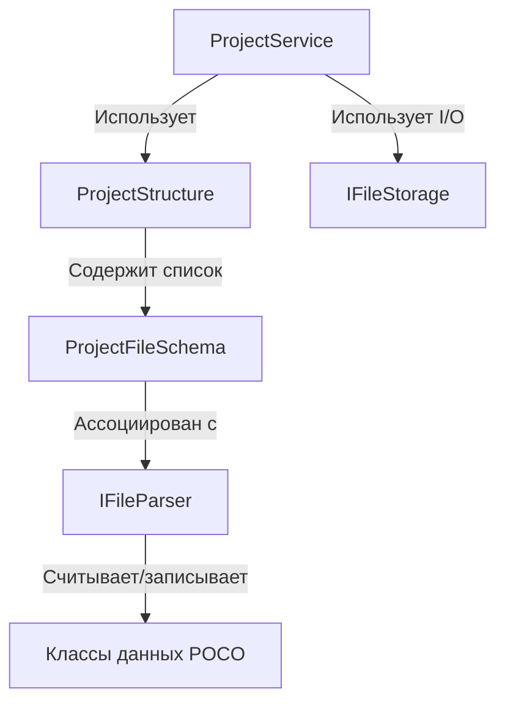

# Подсистема управления структурой проекта (Project Service)

Данный каталог содержит инфраструктуру для создания, валидации, миграции и слияния файлов и директорий проекта.

## Архитектура

Подсистема построена на принципах разделения ответственности (SRP) и независимости от физического диска (I/O):

### Основные компоненты

1. **`ProjectConstants`** (`ProjectConstants.cs`):
   Единая точка хранения всех путей, расширений файлов, обязательных директорий и актуальной версии формата проекта (`ProjectVersion`).
   * `SystemDirectories` — пути системных файлов проекта (вне `Assets/`). Папка и привязанный к ней файл задаются одной константой-путём (например, `ProjectSettings = "Configs/project.toml"` — папка `Configs` выводится как директория этого пути).

2. **`IFileStorage`** (`Infrastructure/IFileStorage.cs`):
   Слой абстракции для операций ввода-вывода (I/O). Позволяет тестировать логику без создания реальных файлов на диске (например, с использованием mock-хранилища).
   * Реализация по умолчанию: `PhysicalFileStorage.cs` (использует `System.IO`).

3. **`IFileParser`** (`Infrastructure/IFileParser.cs`):
   Интерфейс жизненного цикла файла конкретного типа. Отвечает за:
   * `CanParse` — определение того, может ли парсер обработать конкретный файл.
   * `Validate` — проверку формата и валидности данных.
   * `TryGetVersion` — чтение текущей версии файла.
   * `GetDefaultContent` — генерацию начального (дефолтного) содержимого файла.
   * `Migrate` — обновление формата из старой версии в более новую (по цепочке).
   * `Merge` — трехстороннее слияние (Three-way Merge) структуры при конфликтах в Git.

4. **Классы данных (POCO)** (`FileTypes/.../Data.cs`):
   Простые классы без логики (Plain Old CLR Objects), описывающие структуру содержимого файлов. Например, `ProjectSettingsData` для `project.toml`.

5. **`EditorVisibility` и `EditorVisibilityAttribute`** (`Infrastructure/EditorVisibilityAttribute.cs`):
   Enum и C# атрибут для разметки свойств в классах данных (POCO). Позволяют управлять отображением конкретных полей в интерфейсе инспектора редактора (скрывать поля, делать их доступными только для чтения или разрешать редактирование).

---

## Единый формат хранения: TOML

В системе принят **TOML** в качестве единого текстового формата для файлов конфигурации и сцен. Расширение всех файлов — `.toml`.
Для сериализации и десериализации используется единый парсер TOML внутри конкретных реализаций `IFileParser`.

---

## Как добавить новый тип файла в структуру проекта

1. **Создайте константу пути/имени** в `ProjectConstants.cs`.
2. **Создайте каталог** в `FileTypes/<ИмяТипа>/`.
3. **Создайте класс данных POCO** (например, `SceneData.cs`) и **разметьте его свойства** атрибутами `[EditorVisibility]`.
4. **Создайте парсер**, реализующий `IFileParser` (например, `SceneParser.cs`).
5. **Зарегистрируйте файл**, привязав его как `File` к соответствующей системной папке в `ProjectStructure.SystemDirectories` (файл `ProjectStructure.cs`), связав его с созданным парсером.

---

## VCS Слияние (Merge) и Миграции

* **Цепочка миграций (`Migrate`)**:
  При несовпадении версии файла с текущей версией редактора (`ProjectVersion`), парсер выполняет последовательную цепочку миграций (например, `0.9.0 -> 0.9.1 -> 1.0.0`), применяя мелкие шаги конвертации данных.
  
* **Интеллектуальное слияние (`Merge`)**:
  Вместо строчного слияния Git, которое может повредить TOML, парсеры реализуют структурный Three-way Merge на основе AST или десериализованных объектов, гарантируя сохранение валидности файла после разрешения конфликтов.

---

## Проводник и Панель управления (AssetsWidget)

Вкладка «Проект» (Assets) разделена по вертикали на две области просмотра:

1. **Дерево ассетов (Assets Mode)** (сверху):
   * Отображает физическое содержимое каталога `Assets/` с сохранением его реальной иерархии. Папки и файлы выводятся в таком виде, в каком они физически расположены на диске.
   * Относительные пути всех узлов в дереве начинаются с `Assets/` (например, `Assets/MyScripts/Player.cs`).
   * Доступны все операции: создание папок, переименование, удаление.

2. **Системные файлы (System Mode)** (снизу, внутри сворачиваемого `Expander` с заголовком `SYSTEM FILES`):
   * Отображает дерево папок и файлов от корня проекта (например, `Configs`), полностью исключая контентную папку `Assets/`.
   * В системном дереве разрешены только операции копирования имени и открытия в проводнике. Создание, удаление и переименование элементов заблокированы.

### Фильтрация типов ресурсов

* Выпадающий список с чекбоксами. Названия фильтров берутся из первого уровня подкаталогов папки `Assets/` (для режима ассетов) или списка системных каталогов (для системного режима).
* Снятие галочки исключает соответствующий каталог из результирующего дерева отображения.

### Сохранение сессии

* Состояние переключателя режимов (`show_system_mode`) и активных фильтров (`disabled_filters`) сохраняются в файл проекта `Configs/project.toml` в секцию `[editor]` и автоматически восстанавливаются при открытии проекта.
