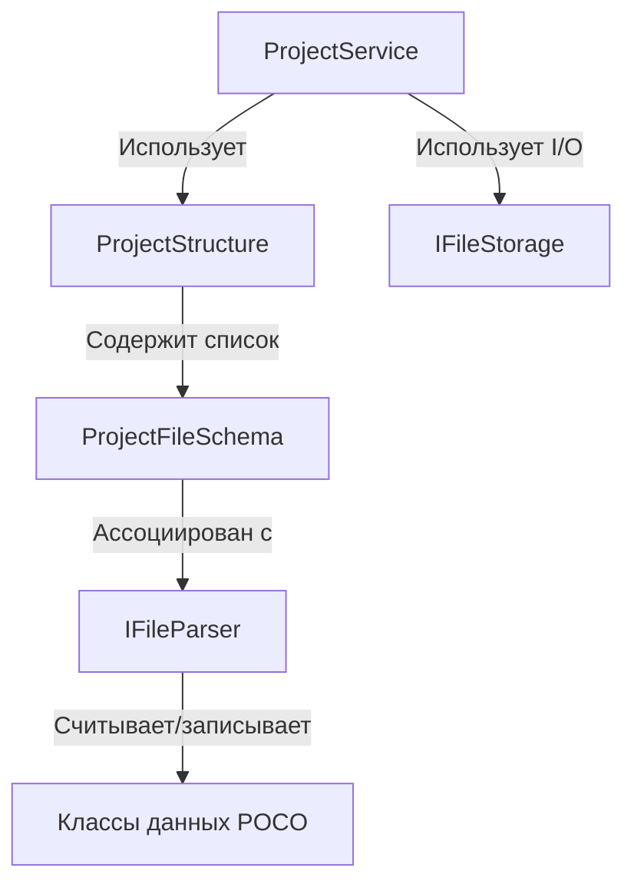

# Подсистема управления структурой проекта (Project Service)

Данный каталог содержит инфраструктуру для создания, валидации, миграции и слияния файлов и директорий проекта.

## Архитектура (Вариант А)

Подсистема построена на принципах разделения ответственности (SRP) и независимости от физического диска (I/O):

### Основные компоненты

1. **`ProjectConstants`** (`ProjectConstants.cs`):
   Единая точка хранения всех путей, расширений файлов, обязательных директорий и актуальной версии формата проекта (`ProjectVersion`).
   
2. **`IFileStorage`** (`Infrastructure/IFileStorage.cs`):
   Слой абстракции для операций ввода-вывода (I/O). Позволяет тестировать логику без создания реальных файлов на диске (например, с использованием mock-хранилища).
   * Реализация по умолчанию: `PhysicalFileStorage.cs` (использует `System.IO`).

3. **`IFileParser`** (`Infrastructure/IFileParser.cs`):
   Интерфейс жизненного цикла файла конкретного типа. Отвечает за:
   * `CanParse` — определение того, может ли парсер обработать конкретный файл.
   * `Validate` — проверку формата и валидности данных.
   * `TryGetVersion` — чтение текущей версии файла.
   * `GetDefaultContent` — генерацию начального (дефолтного) содержимого файла.
   * `Migrate` — обновление формата из старой версии в более новую (по цепочке).
   * `Merge` — трехстороннее слияние (Three-way Merge) структуры при конфликтах в Git.

4. **Классы данных (POCO)** (`FileTypes/.../Data.cs`):
   Простые классы без логики (Plain Old CLR Objects), описывающие структуру содержимого файлов. Например, `ProjectSettingsData` для `project.toml`.

5. **`EditorVisibility` и `EditorVisibilityAttribute`** (`Infrastructure/EditorVisibilityAttribute.cs`):
   Enum и C# атрибут для разметки свойств в классах данных (POCO). Позволяют управлять отображением конкретных полей в интерфейсе инспектора редактора (скрывать поля, делать их доступными только для чтения или разрешать редактирование).

---

## Единый формат хранения: TOML

В системе принят **TOML** в качестве единого текстового формата для файлов конфигурации и сцен. Расширение всех файлов — `.toml`.
Для сериализации и десериализации используется единый парсер TOML внутри конкретных реализаций `IFileParser`.

---

## Как добавить новый тип файла в структуру проекта

1. **Создайте константу пути/имени** в `ProjectConstants.cs`.
2. **Создайте каталог** в `FileTypes/<ИмяТипа>/`.
3. **Создайте класс данных POCO** (например, `SceneData.cs`) и **разметьте его свойства** атрибутами `[EditorVisibility]`.
4. **Создайте парсер**, реализующий `IFileParser` (например, `SceneParser.cs`).
5. **Зарегистрируйте файл** в `ProjectStructure.RequiredFiles` в файле `ProjectStructure.cs`, связав его с созданным парсером.

---

## VCS Слияние (Merge) и Миграции

* **Цепочка миграций (`Migrate`)**:
  При несовпадении версии файла с текущей версией редактора (`ProjectVersion`), парсер выполняет последовательную цепочку миграций (например, `0.9.0 -> 0.9.1 -> 1.0.0`), применяя мелкие шаги конвертации данных.
  
* **Интеллектуальное слияние (`Merge`)**:
  Вместо строчного слияния Git, которое может повредить TOML, парсеры реализуют структурный Three-way Merge на основе AST или десериализованных объектов, гарантируя сохранение валидности файла после разрешения конфликтов.

---

## Виртуальный проводник и Панель управления (AssetsWidget)

В верхней части вкладки «Проект» (Assets) расположена панель инструментов со следующими возможностями:

1. **Переключатель режимов (Assets Mode / System Mode)**:
   * **Assets Mode** (Режим ассетов): Объединяет содержимое всех папок ресурсов (например, `Assets/Scripts`) в единую виртуальную структуру. Корневые обязательные папки скрываются, а их содержимое поднимается в виртуальный корень.
   * **System Mode** (Системный режим): Показывает дерево папок и файлов от корня проекта (например, `Configs`), полностью исключая контентную папку `Assets/`.

2. **Фильтрация типов ресурсов**:
   * Выпадающий список с чекбоксами. Названия фильтров берутся из последнего имени пути обязательной папки (например, для `Assets/Scripts` отобразится `Scripts`).
   * Снятие галочки исключает соответствующий физический каталог из результирующего дерева отображения.

3. **Сохранение сессии**:
   * Состояние переключателя режимов (`show_system_mode`) и активных фильтров (`disabled_filters`) сохраняются в файл проекта `Configs/project.toml` в секцию `[editor]` и автоматически восстанавливаются при открытии проекта.

4. **Визуализация пустых папок**:
   * Пустые виртуальные папки, созданные пользователем, но еще не имеющие файлов на диске, сохраняются в список `empty_folders` файла настроек проекта `Configs/project.toml`.
   * В дереве проводника такие папки выделяются **желтым цветом** (имеют золотистую иконку и текст), подсказывая пользователю, что папка виртуальная. При добавлении первого файла в эту папку она автоматически станет физической на диске.

5. **Контекстные меню**:
   * **Для элементов дерева (папок и файлов)**:
     * *Скопировать имя* — копирует имя выбранного элемента в буфер обмена.
     * *Открыть в проводнике* — открывает физическое расположение файла/папки в Windows Explorer. Скрыто для пустых виртуальных папок.
     * *Переименовать* — переименование элемента прямо в дереве по месту (in-place) без возможности изменить расширение файла (расширение скрыто в дереве). Недоступно для системных папок и файлов.
     * *Добавить -> Папку* — добавляет виртуальную подпапку внутрь выбранного элемента. Недоступно для файлов и системных папок.
   * **Для свободного пространства дерева**:
     * Правый клик по пустому фону дерева в *Asset Mode* открывает меню с единственным пунктом **«Добавить -> Папку»**, позволяя создать виртуальную папку в корне дерева.
     * В *System Mode* контекстное меню для пустого пространства заблокировано, так как изменять системное окружение проекта запрещено.
   * **Ограничения системного режима**:
     * Для директории `Configs` и любых вложенных в неё системных файлов (например, `project.toml`) пункты **«Переименовать»** и **«Добавить»** полностью скрываются из контекстного меню. Изменять системное окружение проекта через виртуальный проводник запрещено.
