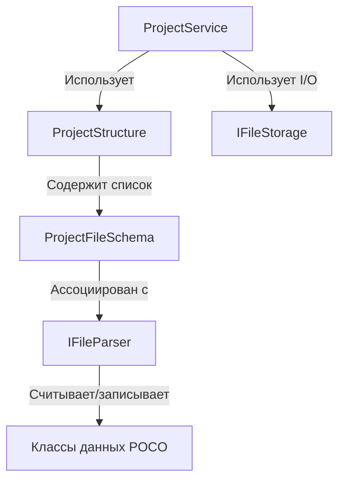

# Подсистема управления структурой проекта (Project Service)

Данный каталог содержит инфраструктуру для создания, валидации, миграции и слияния файлов и директорий проекта.

См. также:

* [`docs/ARCHITECTURE.md`](../../../../../docs/ARCHITECTURE.md) — единая документация по архитектуре, модели ресурсов, скриптингу и стандартам UI.

## Архитектура

Подсистема построена на принципах разделения ответственности (SRP) и независимости от физического диска (I/O):



### Основные компоненты

1. **`ProjectConstants`** (`ProjectConstants.cs`):
   Единая точка хранения всех путей, расширений файлов, обязательных директорий и актуальной версии формата проекта (`ProjectVersion`).
   * `SystemDirectories` — пути системных файлов проекта (вне `Assets/`). Папка и привязанный к ней файл задаются одной константой-путём (например, `ProjectSettings = "Configs/project_config.toml"` — папка `Configs` выводится как директория этого пути).

2. **`IFileStorage`** (`Infrastructure/IFileStorage.cs`):
   Слой абстракции для операций ввода-вывода (I/O). Позволяет тестировать логику без создания реальных файлов на диске (например, с использованием mock-хранилища).
   * Реализация по умолчанию: `PhysicalFileStorage.cs` (использует `System.IO`).

3. **`ProjectFileWatcherService`** (`Infrastructure/ProjectFileWatcherService.cs`):
   Единый владелец `FileSystemWatcher` для папки `Assets/` открытого проекта. UI-виджеты не владеют watcher'ом напрямую; они подписываются на события сервиса.

4. **`ScriptAssetIndexService`** (`Assets/ScriptAssetIndexService.cs`):
   Runtime-кэш скриптовых ассетов (`GUID -> class/path`, `class_name -> scripts`). Синхронизирует `.meta` при открытии проекта и обновляет индекс по событиям `ProjectFileWatcherService`.

5. **`IFileParser`** (`Infrastructure/IFileParser.cs`):
   Интерфейс жизненного цикла файла конкретного типа. Отвечает за:
   * `CanParse` — определение того, может ли парсер обработать конкретный файл.
   * `Validate` — проверку формата и валидности данных.
   * `TryGetVersion` — чтение текущей версии файла.
   * `GetDefaultContent` — генерацию начального (дефолтного) содержимого файла.
   * `Migrate` — обновление формата из старой версии в более новую (по цепочке).
   * `Merge` — трехстороннее слияние (Three-way Merge) структуры при конфликтах в Git.

6. **Классы данных (POCO)** (`FileTypes/.../Data.cs`):
   Простые классы без логики (Plain Old CLR Objects), описывающие структуру содержимого файлов. Например, `ProjectSettingsData` для `project_config.toml`.

7. **`EditorVisibility` и `EditorVisibilityAttribute`** (`Infrastructure/EditorVisibilityAttribute.cs`):
   Enum и C# атрибут для разметки свойств в классах данных (POCO). Позволяют управлять отображением конкретных полей в интерфейсе инспектора редактора (скрывать поля, делать их доступными только для чтения или разрешать редактирование).

---

## Единый формат хранения: TOML

В системе принят **TOML** в качестве единого текстового формата для файлов конфигурации и сцен. Расширение всех файлов — `.toml`.
Для сериализации и десериализации используется единый парсер TOML внутри конкретных реализаций `IFileParser`.

---

## Как добавить новый тип файла в структуру проекта

1. **Создайте константу пути/имени** в `ProjectConstants.cs`.
2. **Создайте каталог** в `FileTypes/<ИмяТипа>/`.
3. **Создайте класс данных POCO** (например, `SceneData.cs`) и **разметьте его свойства** атрибутами `[EditorVisibility]`.
4. **Создайте парсер**, реализующий `IFileParser` (например, `SceneParser.cs`).
5. **Зарегистрируйте файл**, привязав его как `File` к соответствующей системной папке в `ProjectStructure.SystemDirectories` (файл `ProjectStructure.cs`), связав его с созданным парсером.

---

## VCS Слияние (Merge) и Миграции

* **Цепочка миграций (`Migrate`)**:
  При несовпадении версии файла с текущей версией редактора (`ProjectVersion`), парсер выполняет последовательную цепочку миграций (например, `0.9.0 -> 0.9.1 -> 1.0.0`), применяя мелкие шаги конвертации данных.
  
* **Интеллектуальное слияние (`Merge`)**:
  Вместо строчного слияния Git, которое может повредить TOML, парсеры реализуют структурный Three-way Merge на основе AST или десериализованных объектов, гарантируя сохранение валидности файла после разрешения конфликтов.

---

## Проводник и Панель управления (AssetsWidget)

Вкладка «Проект» (Assets) разделена по вертикали на две **одновременно видимые и интерактивные** области просмотра (`AssetsTree` и `SystemTree` — два разных `TreeView`, а не переключаемые режимы одного дерева):

1. **Дерево ассетов (`AssetsTree`)** (сверху):
   * Отображает физическое содержимое каталога `Assets/` с сохранением его реальной иерархии. Папки и файлы выводятся в таком виде, в каком они физически расположены на диске.
   * Относительные пути всех узлов в дереве начинаются с `Assets/` (например, `Assets/MyScripts/Player.cs`).
   * Доступны все операции: создание папок, переименование (повторный клик по имени уже выделенного узла), удаление, перетаскивание (drag & drop) для переноса в другую папку.

2. **Системные файлы (`SystemTree`)** (снизу, внутри сворачиваемого `Expander` с заголовком `SYSTEM FILES`):
   * Отображает дерево папок и файлов от корня проекта (например, `Configs`), полностью исключая контентную папку `Assets/`.
   * В системном дереве разрешены только операции копирования имени и открытия в проводнике. Создание, удаление и переименование элементов заблокированы как в контекстном меню (пункты скрыты), так и в самом шаблоне узла (там физически нет `TextBox` для редактирования имени).

> **Важно:** свойство `AssetsViewModel.IsSystemMode` (и сохраняемая настройка `show_system_mode`) отвечает **только** за то, развёрнута ли секция `SYSTEM FILES` в UI — оно не означает «с каким деревом сейчас работает пользователь», поскольку оба дерева видны и доступны одновременно. Поэтому любой код, выполняющий операцию над конкретным узлом (создание/переименование/удаление/открытие в проводнике/статистика папки), должен определять физическое расположение через `AssetsViewModel.IsSystemNode(node)` (проверка реальной принадлежности узла дереву `SystemRootNodes`), а **не** через `IsSystemMode`. Использование тумблера для этого приводило к тому, что операции с ассетами при развёрнутой секции `SYSTEM FILES` ошибочно применялись к системному дереву.

### Порядок пунктов контекстного меню

Пункт «Добавить» (`AddMenuItem`) идёт первым, затем «Копировать имя», «Открыть в проводнике», «Удалить» — порядок одинаков для обоих деревьев.

### Поиск по имени

* Поле поиска в тулбаре (общий стиль `Style_SearchTextBox` из `Themes/DarkTheme.xaml`, тот же, что в Консоли) привязано к `AssetsViewModel.SearchText`.
* Действует **только** на `AssetsTree`: скрывает узлы, чьё имя (и имена всех потомков) не содержат искомую подстроку. Папка остаётся видимой, если совпадает сама или хотя бы один её потомок — реализовано через `ProjectNode.IsSearchVisible` и `AssetsViewModel.ApplySearchFilter`, который обходит только `AssetRootNodes`.
* `SystemTree` не имеет привязки к `IsSearchVisible` в своём `ItemContainerStyle` вообще — структурно не может быть затронут поиском, а не просто "выключен по умолчанию".
* Пересчитывается заново при каждом `RefreshTree()` (создание/переименование/удаление/перенос/смена фильтра), так как узлы дерева полностью пересобираются.

### Раздельные фильтры для Assets и System

* `ProjectSettingsData.DisabledFilters` (ассеты) и `DisabledSystemFilters` (системные файлы) хранятся **раздельно** в `Configs/project_config.toml` (`disabled_filters` / `disabled_system_filters`). Это устраняет утечку: снятие галочки фильтра в одном дереве больше не может скрыть одноимённую папку в другом дереве, так как `RefreshTree()` передаёт каждому `BuildTree()` свой список.
* Старые файлы `project_config.toml` без `disabled_system_filters` читаются нормально — поле по умолчанию пустое.
* У `SystemTree` сейчас нет своего UI для редактирования `DisabledSystemFilters` (см. ниже) — поле сохраняется/применяется в дереве, но управлять им через чекбоксы пока нельзя.

### Drag & Drop (перенос узлов)

* Реализовано только для `AssetsTree` (перетаскивание из/в `SystemTree` не поддерживается — он read-only). Работает одинаково для папок и файлов, так как физически это один и тот же `MoveOrRenameCommand`, что и при переименовании — отличается только то, что меняется родительская папка, а не имя.
* Перетаскивание начинается после превышения порога `SystemParameters.Minimum{Horizontal,Vertical}DragDistance` (чтобы не конфликтовать с обычным кликом/переименованием по повторному клику).
* Узел, на который наведено перетаскивание, подсвечивается (`Brush_Hover`), если перенос в него допустим.
* Бросок на файл переносит узел в папку, содержащую этот файл (как если бы бросили на саму папку). Бросок на пустую область дерева переносит в корень `Assets/`.
* Перенос блокируется (без переноса, без ошибки), если: целевая папка совпадает с текущей родительской (no-op), целевая папка — сам перетаскиваемый узел, или (для папок) целевая папка является потомком перетаскиваемой папки (защита от создания цикла).
* Коллизия имени в папке назначения — обычная ошибка (`Validation_FolderName_Exists` / `Validation_FileName_Exists`), как и при переименовании.
* Фиксируется в Undo/Redo через `MoveOrRenameCommand` (`App.ProjectService.History`) — отмена переноса работает как отмена переименования.

### Локализация

Все надписи контекстного меню, имя по умолчанию для новой папки (`Tree_NewFolder_Name`) и тексты ошибок (недопустимые символы, существующий файл/папка, ошибки создания/переименования/удаления) вынесены в `Resources/Loc.ru-RU.xaml` и `Loc.en-US.xaml`. В `AssetsWidget.xaml.cs` для чтения этих ресурсов используется локальный хелпер `Loc(key, fallback)`. Хардкод текста в этом виджете не допускается.

### Фильтрация типов ресурсов

* В тулбаре над `AssetsTree` одна кнопка-фильтр (воронка) и кнопка сброса — они привязаны к `AssetsViewModel.AvailableFilters`/`ResetFiltersCommand` и относятся **только** к `AssetsTree`. Список фильтра **всегда** показывает фиксированное перечисление `AssetResourceType` (`editor.Models/AssetResourceType.cs`: `Texture`, `Model`, `Audio`, `Scene`, `Script`, `Shader`, `Material`), независимо от того, развёрнута ли секция `SYSTEM FILES`.
* Раньше `UpdateFiltersList()`/`OnFilterCheckedChanged()`/`ResetCurrentFilters()` переключали содержимое этой же кнопки на список системных папок (`ProjectStructure.SystemDirectories`) через `IsSystemMode` — тот же класс ошибки, что и с операциями над деревом (см. предупреждение про `IsSystemMode` выше): при раскрытом `SYSTEM FILES` пользователь видел в фильтре системные папки (например, «Config») вместо типов ресурсов. Исправлено: эта кнопка больше не смотрит на `IsSystemMode` и всегда работает с `AssetResourceType`/`settings.DisabledFilters`.
* Список фильтра не зависит от того, какие папки физически существуют в `Assets/` на диске — он не сканирует диск.
* `AssetResourceTypeRules.GetFolderName(type)` задаёт условное имя папки первого уровня, с которым тип сопоставляется при построении дерева (`disabled_filters` в `project_config.toml` хранит именно эти имена) — привязка конкретных файлов/папок к типу по содержимому/расширению не реализована, это будущая задача; пока соответствие чисто по имени папки.
* `AssetResourceTypeRules.GetTitleKey(type)` даёт ключ локализации для подписи чекбокса (`Resources/Loc.*.xaml`, ключи `ResourceType_*`). `FilterItemViewModel` хранит локализованное `Name` (для UI) отдельно от `MatchKey` (условное имя папки, используется для сравнения с `DisabledFilters`/`DisabledSystemFilters` и для перестроения дерева) — иначе сравнение по `Name` ломалось бы при смене языка.
* Снятие галочки исключает все папки, физически совпадающие по имени с `MatchKey` фильтра, из результирующего дерева отображения.
* `AssetsViewModel.UpdateTitle()` переопределён и пересчитывает подписи фильтров (`UpdateFiltersList()`) при смене языка редактора, так как они локализованы.

### Сохранение сессии

* Состояние переключателя режимов (`show_system_mode`) и активных фильтров (`disabled_filters`) сохраняются в файл проекта `Configs/project_config.toml` в секцию `[editor]` и автоматически восстанавливаются при открытии проекта.

### Оформление (скроллбары)

`ScrollBar` во всём редакторе (оба дерева `AssetsWidget`, консоль, инспектор и т.д.) оформлен одним неименованным (`без x:Key`) стилем `TargetType="{x:Type ScrollBar}"` в `Themes/DarkTheme.xaml`. Он применяется неявно ко всем скроллбарам приложения через `Application.Resources` (см. `App.xaml`) — отдельную стилизацию под тёмную тему в конкретных виджетах добавлять не нужно.

### Сообщения об ошибках операций с файлами/папками — лог, не диалог

Ошибки операций над файлами/папками в `AssetsWidget` (недопустимые символы, коллизия имени при переименовании/переносе, исключения при создании/переименовании/удалении) **не показываются всплывающим окном** — они уходят в `EditorLogger.LogError(...)` (`Services/EditorLogger.cs`), тот же канал, что используется для логов движка/скриптов, и отображаются в `Console`. Диалоговое окно осталось только для подтверждения удаления (`MessageBox.Show` с `YesNo` перед самим удалением) — это запрос подтверждения действия, а не вывод ошибки.

### Inspector: редактирование `Configs/project_config.toml`

* `InspectorViewModel` строит список редактируемых полей через reflection по свойствам `ProjectSettingsData`, помеченным `[EditorVisibility(EditorVisibility.Editable)]`/`ReadOnly` (см. `TomlPropertyViewModel`). Поля со `Hidden` (например, `DisabledFilters`) не попадают в список.
* Текстовые поля в `InspectorWidget.xaml` однострочные (`TextWrapping="NoWrap"`, `AcceptsReturn="False"`) и применяют значение при потере фокуса (`UpdateSourceTrigger=LostFocus`) либо по Enter — `ValueTextBox_PreviewKeyDown` в `InspectorWidget.xaml.cs` вызывает `BindingExpression.UpdateSource()` вручную, так как однострочный `TextBox` без `AcceptsReturn` не реагирует на Enter сам.
* Поле **`Name`** (имя проекта) обрабатывается особым образом — изменение этого поля не просто пишет строку в `project_config.toml`, а **физически переименовывает корневую папку проекта на диске** (`ProjectService.RenameProject(newName, out error)`):
  * Валидация — `ProjectService.IsValidProjectName` (непустое имя, без недопустимых для имени файла символов) плюс проверка, что папка с новым именем ещё не существует (кроме переименования только регистра).
  * При успехе: `Directory`/`IFileStorage.MoveDirectory` физически переименовывает папку, `ProjectService.CurrentProjectRootPath` обновляется (хранится как поле, а не захватывается замыканием по старому пути — иначе автосохранение `project_config.toml` после переименования продолжало бы писать в старую, уже не существующую папку), `CurrentSettings.Name` сохраняется в `project_config.toml` уже по новому пути. Затем `MainWindowViewModel.UpdateAfterProjectRename(newPath)` обновляет `CurrentProjectPath`, сессию (`LastOpenProjectPath`) и соответствующую запись в списке последних проектов.
  * При неудаче: ошибка уходит в `EditorLogger.LogError` (не диалог), а отображаемое значение в поле откатывается на прежнее корректное имя.
  * Связка реализована через специальный конструктор `TomlPropertyViewModel(owner, propInfo, visibility, Action<string> onProjectRenamed)`, выбираемый в `InspectorViewModel.OnSelectedItemChanged` только для свойства `ProjectSettingsData.Name` — остальные поля используют обычный путь (`_propInfo.SetValue` + `SetProperty`/`HistoryManager` для авто-Undo/автосохранения).
  * `IFileStorage.MoveDirectory` (`Directory.Move`) может упасть с `IOException`/"Access denied", если папка проекта открыта в Проводнике, терминале или другой программе (ОС держит хендл на саму директорию, а не на её содержимое — это не связано с правами доступа). `RenameProject` ловит `IOException` отдельно и логирует более понятное сообщение (`Error_RenameProject_FolderInUse`) с подсказкой закрыть папку в других программах, вместо голого текста ОС.
### Inspector config bridge

The inspector edits selected system config files through parser metadata, not through
`ProjectService.CurrentSettings` or `CurrentGameConfig`.

Current flow:

1. `ProjectNode.RelativePath` is matched against `ProjectStructure.AllFiles`.
2. The file parser must implement `IEditorConfigParser`.
3. `DeserializeForEditor()` returns the POCO data object for reflection.
4. `TomlPropertyViewModel` reads editor attributes from each property.
5. On edit, `SerializeFromEditor()` writes the same config file back.

Editor-only property metadata lives in
`Infrastructure/EditorVisibilityAttribute.cs`:

* `EditorVisibilityAttribute` - hidden/read-only/editable fields.
* `EditorOptionsAttribute` - scalar combo-box values, currently log listeners.
* `EditorCollectionAttribute` - list rendering, sorting, duplicate rules, and
  optional `AssetResourceType` hints for GUID references.

`Configs/game_config.toml` currently uses reflected fields for:

```toml
defines = []
log_listener = ""
global_script_guids = []
```

`global_script_guids` is an ordered list of global game script GUIDs. The later
script picker/highlight UI should resolve those GUIDs through `ScriptAssetIndexService`.
